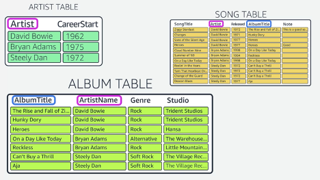

https://www.coursera.org/learn/dynamodb-nosql-database-driven-apps/lecture/Zhkb1/single-table

When you are working with DynamoDB, we recommend that you do not split your data across multiple tables, but, instead,
you store your related data into one singular table. Once your data is modeled correctly and is in one table, you can
use secondary indexes to efficiently query.

# Queries

In order to use the single-table concept, you must know the queries you're going make before you create your table. This
is not like SQL databases. Traditionally, with a SQL database, you design the schema, normalize your data, and then you
write your queries to retrieve data out of the existing schema. With DynamoDB, you invert that relationship.

So:

- find all songs by artist 
- find all albums in a genre 
- find all songs released by an artist in a year
- find all songs with the same song title
